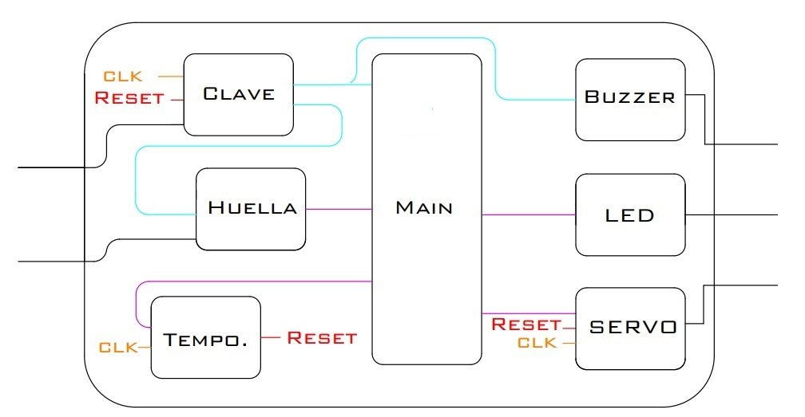
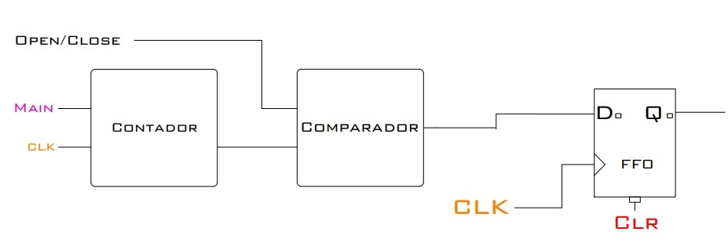

# Contenido
En este proyecto de GitHub se encuentra toda la información referente al proyecto de una cerradura segura digital, el cual se presentó como proyecto final de la materia Electrónica Digital I de la Universidad Nacional de Colombia.

Luego de describir el contenido del GitHub, se presenta el informe del proyecto dentro de este archivo README.

Dentro de la carpeta **FPGACerradura** se encuentrá todo el proyecto para el software Quartus. Los archivos más relevantes son los que tienen extensión .vhd, y corresponden al código de descripción de hardware (VHDL) para programar el funcionamiento de la FPGA.

Archivos VHDL relevantes:
+ CLAVE.vhd -> se encarga del sistema de autenticación por contraseña de 6 dígitos utilizando 4 pulsadores.
+ FCV.vhd -> librería personalizada para codificar los tipos de datos que se trabajan a lo largo de las señales.
+ Huella.vhd -> se encarga de enviar y recibir la información de comunicación con el Arduino (sistema de la huella dactilar).
+ LED.vhd -> se encarga de definir los colores del LED en base al estado del sistema.
+ Main.vhd -> el archivo principal que se encarga de conectar las diferentes entidades, recibir las entradas de la FPGA y definir las salidas de la FPGA.
+ SERVO.vhd -> define la señal de control PWM para ubicar la posición del servomotor en base a la autenticación.
+ Temporizador.vhd -> es un contador que se encarga de reiniciar el sistema luego de un tiempo de haber abierto la puerta.
+ div_frec.vdh -> es un divisor de frecuencia para poder definir los diferentes clocks de los circuitos secuenciales a partir del clock de la FPGA.

Dentro de la carpeta **SensorHuellaArduino** se encuenta toda la información referente al sistema Arduino-SensorHuella. Cierta información puede ser específica del sensor que se tenga, por ende, revisar y aplicar la información con precaución.

Archivos relevantes Arduino-SensorHuella:
+ La librería para trabajar con el sensor con Arduino es el archivo .zip. Esta librería (de libre acceso) pertenece a INNOVA DOMOTICS y pueden encontrar sus videos tutoriales en:
    + https://www.youtube.com/watch?v=2dCMj4unW2M
    + https://www.youtube.com/watch?v=N9fsM_HwapU
+ El archivo AuthHuella/AuthHuella.ino es el código que se sube en el Arduino UNO para el funcionamiento de todo el sistema. En este archivo se reciben entradas digitales de la FPGA y se mandan salidas digitales a la FPGA. Además, se realiza toda la conexión con el sensor de huella dactilar y se autentica con la librería mencionada anteriormente. 
    + **IMPORTANTE:** Para enviar señales digitales entre una FPGA y un Arduino, se debe revisar los valores de voltaje que trabajan. En este proyecto, se utilzaron divisores de frecuencia para mandar la señal desde el Arduino (5V) hacia la FPGA (3.3V).

El archivo .pdf es el póster que se presentó en el **TECHFEST 2023** que se realizó en la Universidad El Bosque, Bogotá.

# Cerradura Digital

  

**Laboratorio Electrónica Digital I**

**Proyecto Final: Cerradura Digital**

Programas de:

Ingeniería Eléctrica y Mecatrónica

**Felipe Cruz Vásquez**

**Juan Sebastian Perdomo Caicedo**

**Juan Diego Tovar Cárdenas**

Profesor:
**Diego Alexander Tibaduiza Burgos**

Materia: Electrónica Digital I

Universidad Nacional de Colombia

Bogotá D.C.

Facultad de Ingeniería

2023

# Planteamiento del problema
## Identificación del problema

La poca seguridad que brindan las cerraduras tradicionales en el acceso a una casa en la ciudad de Bogotá. Las cerraduras tradicionales basan su seguridad en una llave que puede ser robada y duplicada, o la cerradura puede ser forzada y abierta de manera sencilla.

## Datos respecto al problema
+ Más de 6.000 Viviendas fueron robadas en Bogotá. (Infobae, I. (2022, December 31). Más de 6.000 Viviendas Fueron robadas en Bogotá. Retrieved April 30, 2023, from https://www.infobae.com/america/colombia/2022/12/31/mas-de-6000-viviendas-fueron-robadas-en-bogota/).
+ Aumentan los robos en casas según el informe del Ministerio del Interior. (Ficarazzi, G. (2023, January 27). Aumentan los robos en Casas según el informe del ministerio del interior. Retrieved April 30, 2023, from https://cuadernosdeseguridad.com/2022/12/aumentan-robos-casa/).
+ Los Robos con fuerza en viviendas aumentan un 22\%. (Jaenes, M. (2022, December 15). Los Robos con fuerza en viviendas aumentan un 22\% ¿Qué hacer en estos casos? Retrieved April 30, 2023, from https://www.lasexta.com/noticias/sociedad/robos-fuerza-viviendas-aumentan-22-que-hacer-estos-casos-20221215639b29a04954a50001c5813a.html).

## Análisis PESTAL
+ **Político:** Las políticas de regulación y control en la fabricación y venta de cerraduras pueden influir en la calidad y resistencia de estas. Además, las políticas de aplicación de una ley en torno al desarrollo de estas, pueden afectar la capacidad de las autoridades para prevenir y responder ante los problemas de seguridad en las residencias.
+ **Económico:** La poca seguridad de las cerraduras comunes permite una cantidad de robos a hogares mayor, lo cual se ve reflejado en gastos económicos para los afectados. Los ladrones generalmente se llevan cosas cuyo valor económico es alto, y las víctimas solo pueden recuperar lo robado comprando cosas nuevas, es decir, gastando dinero extra.      
+ **Social:** La percepción de inseguridad en Bogotá es alta, y muchas personas dependen de su cerradura como mayor elemento de seguridad entre su hogar y la calle. La falta de seguridad en las cerraduras puede aumentar la vulnerabilidad de los ciudadanos ante la delincuencia, lo que afecta su calidad de vida y su sensación de seguridad, por lo que el proyecto podría tener una buena acogida entre la población, especialmente en áreas de alto riesgo.
+ **Tecnológico:** La tecnología está en constante evolución y existen sistemas de cerraduras más avanzados y seguros que se están desarrollando y comercializando. Las cerraduras tradicionales no suelen aplicar tecnologías modernas para mantener la seguridad, ya que se basan en una llave que puede ser robada y duplicada fácilmente.
+ **Ambiental:** El proyecto no tiene un impacto directo en el medio ambiente.
+ **Legal:** A pesar de que existe la Ley 1801 de 2016 (Código Nacional de Policía y Convivencia), que establece sanciones para los propietarios de viviendas que no adopten medidas de seguridad adecuadas, como el uso de cerraduras seguras y el artículo 277 de este código establece la obligación de los propietarios de viviendas de mantener en buen estado las cerraduras y dispositivos de seguridad, no existe ningún organismo que vele por el cumplimento de estas normas. Además, en la sentencia C-519-07 de la Corte Constitucional de Colombia se menciona el derecho a la inviolabilidad del domicilio, que se resume en que un domicilio (vivienda, habitación, etc.) no puede ser invadida por otras personas sin la autorización del dueño.

## Antecedentes

La ciudad de Bogotá ha experimentado una creciente preocupación por la seguridad ciudadana en los últimos años, particularmente en relación con la delincuencia en los hogares y los robos.

Los informes indican que la mayoría de los robos en hogares en Bogotá ocurren durante el día, y la mayoría de los ladrones ingresan por la puerta principal.

Existen diferentes tipos de cerraduras, algunas más seguras que otras, y algunos fabricantes han desarrollado tecnologías más avanzadas para mejorar la seguridad de las cerraduras.

Sin embargo, la falta de conocimiento o de acceso a estas tecnologías por parte de algunos sectores de la población puede limitar su efectividad en la mejora de la seguridad en la ciudad. Además, la implementación de políticas públicas y regulaciones que establezcan los requisitos mínimos de seguridad para las cerraduras, y la promoción de tecnologías de seguridad más avanzadas y accesibles, pueden ser importantes para abordar el problema de la poca seguridad que brindan las cerraduras tradicionales en el acceso a una casa en Bogotá.

## Posibles soluciones
+ Modificar la normatividad relacionada con la fabricación e implementación de las cerraduras actuales para que estas cumplan con los mínimos estipulados en la Ley.
+ Crear y promover el uso de alarmas vinculadas con las estaciones de policía cercanas a los hogares con el objetivo de mejorar el tiempo de respuesta y contar con el apoyo de la fuerza pública.
+ Creación de nuevas cerraduras que brinden seguridad en las viviendas sin necesidad de depender tanto de la fuerza pública.

## Objetivos
+ **Principal**
    + Diseñar un sistema que mejore la seguridad, sobre una puerta, para el ingreso de personas.
+ **Secundarios**
    + Aplicar reconocimiento biométrico de huellas dactilares.
    + Diseñar e implementar un sistema de contraseña con pulsadores.
    + Permitir o restringir el ingreso de personas mediante un proceso de autenticación.
    + Informar el estado de autenticación con señal lumínica.

## Actores y roles del proyecto
+ Fabricantes de cerraduras: diseñan, producen y distribuyen cerraduras para uso residencial y comercial.
+ Residentes o consumidores: Utilizan las cerraduras para proteger sus propiedades, son los clientes del producto y el colectivo principal del problema.
+ Ladrones: Causantes de los robos a propiedades y bienes debido a la falta de seguridad de las cerraduras.
+ Ingenieros: Responsables del diseño y desarrollo del proyecto (cerraduras).
+ Proveedores y fabricantes: Producen y suministran los materiales para el desarrollo del proyecto y suministran las cerraduras actuales al mercado.
+ Distribuidores y vendedores: Venden y reparten para los diferentes puntos de venta las cerraduras.
+ Gerente del proyecto: Coordina todos los aspectos del proyecto y es responsable de garantizar la seguridad y eficacia del producto final.

## Presupuesto
El presupuesto estimado para un mes se presenta a continuación:

| Elemento                             | Precio      |
| ------------------------------------ | ----------- |
| **Ingeniero 1**                      | \$2'500.000 |
| **Ingeniero 2**                      | \$2'500.000 |
| **Ingeniero 3**                      | \$2'500.000 |
| Tarjeta de desarrollo FPGA           | \$659.974   |
| Módulo LED RGB                       | \$5.018     |
| Micro Servomotor SG90 9G             | \$13.328    |
| Servicio de Impresión 3D             | \$20.000    |
| Módulo lector de huella As608        | \$56.000    |
| Arduino UNO                          | \$53.550    |
| Insumos (PC, Internet, Luz, etc.)    | \$3'000.000 |
| **Total**                            | **\$11'303.550** |

# Esquemas
A continuación se detalla las cajas necesarias para el desarrollo del proyecto. Se describen de manera general y específica para su mayor comprensión.
## General
Para la realización del proyecto se realizo un esquema general de las entradas y salidas del sistema, como se puede observar a continuación se tiene como entradas la clave que será digitada con 4 pulsadores. 

Caja general del sistema de cerradura de seguridad

Como se puede ver a continuación se detalló las cajas que componen el sistema general con las entradas correspondientes. El “Main” es la caja central de control y se requieren de otras como se específica a continuación, además es importante aclara que el “CLK” que se encuentra en la entrada de varias de las cajas es el CLK que tiene la FPGA internamente.

Caja general con las cajas internas

## Huella
A continuación, se especifica que tienen cada una de las cajas que componen el sistema empezando por la caja de huella.

Detalle de la Caja Huella

Como se puede ver, el sistema es completamente controlado por el Arduino, ya que es este es el que recibe la señal del dispositivo de huellas para saber si la huella ingresada esta guardada o no, el Arduino está constantemente conectado a la FPGA y a la caja de “Clave” para saber el estado del resto del sistema.

## Temporizador
El temporizador está únicamente compuesto por un contador, que cuando se llega al tiempo determinado manda un uno para el “Reset” de todos los elementos del sistema.

Detalle de la Caja Temporizador

## Clave
Para la clave se tienen dos elementos, el primero son los flip flops que van a ir guardando la clave que el usuario ingrese, se tiene presente que son 4 botones, pero la clave tiene 6 dígitos. El segundo elemento es un comparador que nos va a determinar si la clave ingresada por el usuario es la correcta, la salida de este comparador se conecta con el “Main” y la con caja de "Huella" los cuales van a recibir por parte del comparador un 1 o un 0.

Detalle de la Caja Clave

### Circuito interno de la Caja Clave

Para este circuito se usaron dos registros de desplazamiento, cada uno conformado por 6 Flip Flops. A la caja ingresa un número de dos Bits donde cada número corresponde a un pulsador de la siguiente manera:
+ 00 → Pulsador 1
+ 01 → Pulsador 2
+ 10 → Pulsador 3
+ 11 → Pulsador 4

Una vez se oprime uno de los pulsadores, el número correspondiente a ese pulsador se divide entre los dos registros, el primer Bit se va para el primer registro de desplazamiento y el segundo bit del mismo número se va para el segundo registro. A medida que se oprime nuevamente otro pulsador, los bits de cada uno de los registros se va desplazando hacia la derecha, una vez que se haya ingresado un número de 6 dígitos cada uno de los Flip Flops va a tener un cero o un uno dependiendo de la secuencia en que se haya ingresado la clave, cada uno de estos bits se estará comparando todo el tiempo mediante una compuerta "AND" con un número establecido que corresponde a la clave correcta, de modo que cuando se ingrese la clave correcta todas las compuertas "AND" tendrán un 1 en su salida y todas estas salidas están evaluadas por otra compuerta "AND".

Cuando todas las compuertas "AND" conectadas al los Flip Flops tengan un 1 en su salida, la compuerta final también dará un 1 a su salida determinando que la clave ingresada es correcta y permitiendo que el usuario siga con el siguiente paso para poder abrir la cerradura. En el caso en que la clave sea incorrecta, alguna de las primeras compuertas tendrá un 0 en su salida, dando como resultado en la compuerta final un 0 y no permitiendo al usuario continuar con el siguiente paso del sistema.

## Servomotor
Para el servomotor lo que se tiene internamente es una “PWM”, ya que el servomotor se mueve según el ciclo de trabajo de esta, esta señal la procesa directamente el servomotor e interpreta cuanto se tiene que mover y en qué dirección.

Detalle de la Caja Servomotor

### Circuito interno de la Caja PWM

Para esta parte del sistema fue necesario usar un contador y un comparador para poder establecer una señal de PWM variable. Primero el comparador recibe del Main una señal para saber hasta qué valor tiene que contar que es un valor constante determinado por el modelo del servomotor. El comparador es una de las cajas más importantes en este proceso, ya que este recibe una señal para saber si el servomotor tiene que estar abierto o cerrado y determinar el valor de corte para que la señal de PWM pase de estado alto a estado bajo. 

Por ejemplo, si el servomotor funciona con un periodo de 100 ms y para que esté abierto el servomotor tiene que estar 80 ms en alto y 20 ms en bajo, lo primero que el sistema hace es mandarle la señal al contador de que tiene que contar hasta 100 ms, después de este valor se vuelve 0 y comienza a contar de nuevo, por otra parte, el comparador va a recibir la señal de que tiene que estar en alto 80 ms, por lo que constantemente va a comparar el conteo hasta que llegue a este valor, la señal de salida del comparador será 1 para todos los valores menores a 80 ms y 0 para el resto de los valores hasta terminar el conteo, la señal de salida del comparador se guarda en un Flip Flop para una mayor exactitud del valor de salida para la PWM.

## Main
El “Main” es uno de los elementos más importantes, ya que es la que recibe la señal de la huella y de la clave y determina el estado de las salidas. El LED cambia su color dependiendo de la señal que reciba, por lo tanto, está conectado a un multiplexor que determina cuál es la señal que ingresa y determina el color que tiene que alumbrar. Por otro lado, tenemos una compuerta AND que nos dice si la clave y la huella son correctas, de ser así esta manda la señal correspondiente a las salidas para que cambien su estado.

Detalle de la Caja Main

## Diagrama de máquina de estados

A continuación se muestra el diagrama de máquina de estados realizado para el presente proyecto. Cada uno de los estados se especifica a continuación:
+ S0 = El Arduino no está inicializado.
+ S1 = El Arduino está inicializado y el sistema está listo para recibir la clave.
+ S2 = La clave introducida es correcta y el sistema está listo para recibir la huella.
+ S4 = la Huella introducida es válida y la cerradura se encuentra abierta.

Ahora la notación que se usó para el desarrollo del diagrama fue la siguiente:

+ Arduino . Clave . Huella / LED . Cerradura

Para cada uno se usó uno o dos bits y su representación sé específica a continuación:

1. Arduino:
   - 0 → El Arduino no está inicializado.
   - 1  → El Arduino está inicializado.
2. Clave:
   - 0 → No se ha introducido ninguna clave - La clave introducida es incorrecta.
   - 1  → La clave introducida es correcta.
3. Huella:
   - 0 → No se ha introducido ninguna huella- La huella introducida no está registrada.
   - 1  → La huella introducida está registrada.
4. LED:
   - 00 → Blanco.
   - 01 → Rojo.
   - 10 → Azul.
   - 11 → Verde.
5. Cerradura:
   - 0 → La cerradura se encuentra cerrada.
   - 1  → La cerradura se encuentra abierta.

Por último, como se puede observar en el diagrama, la máquina de estados cuenta con dos Reset. El "Reset 1" es para cuando se reinicia el Arduino o se Reinicia todo el sistema por completo, de modo que entra al estado S0, mientras que es "Reset 2" es cuando re reinicia el sistema de manera automática cuando la cerradura se abre y ya paso el tiempo de apertura por lo que entra al estado S1 y el sistema queda listo para recibir de nuevo una clave.

# Problemas en el desarrollo del proyecto
+ Al momento de conectar el detector de huella, los colores de las conexiones no correspondían con los colores estándar para identificar la función de cada uno de los cables, por lo que fue necesario recurrir al datasheet para poder realizar las conexiones de manera correcta y evitar danos en el dispositivo.
+ Cuando se implementó el “Reset” era necesario que la FPGA le comunicara al Arduino que desautorizara la huella y quedara lista para recibir otra huella nuevamente, ya que la huella y la clave funcionaban de manera paralela como sistemas independientes, entonces tocaba reiniciar cada sistema por separado, sin embargo, esta comunicación entre la FPGA y el Arduino no se realizaba de manera correcta, puesto que el sistema comenzaba a oscilar, este problema es probable que se presentara por la diferencia entre las tensiones de los elementos, ya que la FPGA tiene una salida de 3.3V y el Arduino trabaja con 5V. \enter Para solucionar este problema se priorizó la clave para el control de todo el sistema, de modo que sea necesario tener la clave correcta para poder activar la detección de huella, de esta manera cuando se activaba el “Reset” se reiniciaba la clave y como la huella quede dependiendo de esta, se lograba el objetivo de reiniciar todo el sistema.
+ Cuando se estaba realizando la asignación de pines del Quartus para cargar la programación a la FPGA, es importante que los bloques de pines tengan la misma tensión para evitar daños en la FPGA.

# Video funcionamiento

https://github.com/Pcjs123/Cerradura_Digital/assets/129623339/8cf16f61-6271-4a3b-9256-23d0ff4f29aa

# Conclusiones
+ Se realizó la construcción e implementación de un sistema que mejora la seguridad en puerta mediante una cerradura digital, que permite o restringe el ingreso de personas mediante un proceso de autenticación.
+ Se aplicaron conocimientos de reconocimiento biométrico de huellas dactilares y se implementó un sistema de contraseña haciendo uso de pulsadores.
+ Se realizó un sistema digital usando la tarjeta de desarrollo FPGA, empleando conocimientos con operaciones lógicas digitales.

Se cumplió con todos los objetivos del proyecto. El sistema utilizado es más seguro que un sistema de llave ya que la huella dactilar de una persona es más difícil de clonar y no se pierde. Además, tener una contraseña para habilitar el sistema de huella agrega seguridad ya que un ladrón no conoce dicha contraseña en un principio.

Para una implementación real del sistema se debe cambiar el servomotor por todo un sistema más robusto para la puerta que no permita ser abierta a la fuerza y que en caso de falta de energía, tenga batería de repuesto para evitar que deje de funcionar por falta de electricidad. Además, en vez de usar un temporizador para reiniciar el sistema y cerrar la puerta, se debe poner un sensor que detecte cuando se cierra la puerta y que, en base a la señal del sensor, reinicie el sistema de autenticación.
